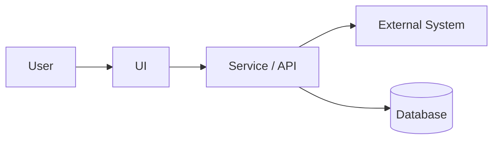
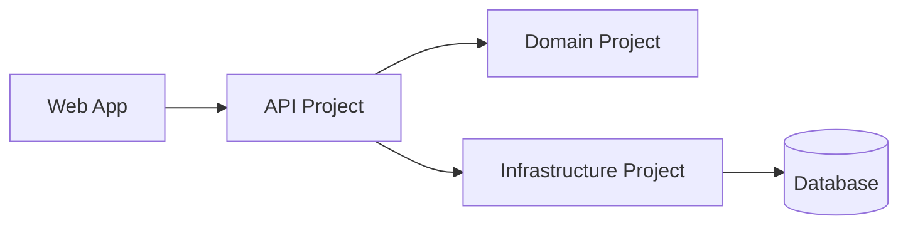
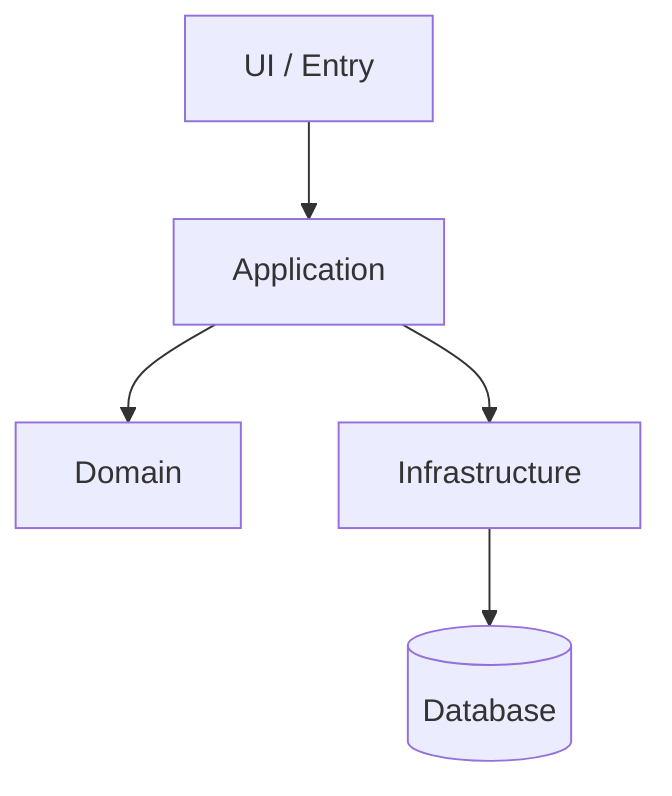
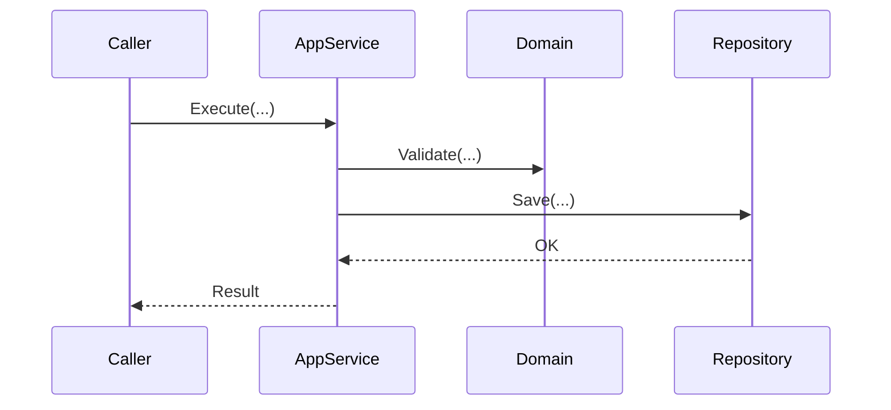
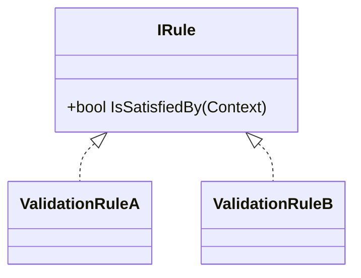
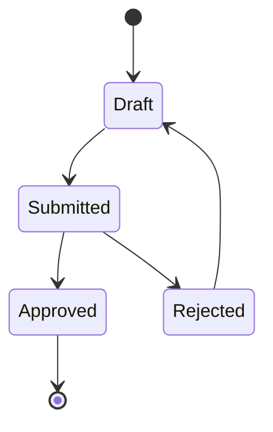

# Documentation levels & Mermaid diagrams

Please use this when you want to (re)generate documentation and diagrams after refactoring reveals clearer structure.

**Pattern**: Documentation + Diagram Leveling Pattern ⭐⭐⭐⭐  
**Effectiveness**: Helps communicate architecture without docs rot  
**Use When**: You need consistent L0–L3 docs and Mermaid diagrams, and want to avoid “diagram everything” output

---

## Purpose

Help the agent produce diagrams and documentation at **the right level of abstraction**:

- Enough to communicate structure and flow
- Not so detailed that docs rot immediately

---

## Decision guide (pick the minimum level that works)

- **If the question is “what systems/users exist and how do they relate?”** → L0
- **If the question is “what projects/services run where, and who calls whom?”** → L1
- **If the question is “what modules own what responsibilities, and what are dependency rules?”** → L2 (default)
- **If the question is “what are the key abstractions/state machines in this tricky area?”** → L3 (selective)

Rule of thumb: default to **L2**, add **L3** only for the few “hard” parts.

---

## Documentation levels (choose what you need)

### L0 — System context (Why/Who)

- Audience: stakeholders, new devs
- Content: systems, users, external dependencies
- Diagram: Mermaid `flowchart` (context map style)

### L1 — Container / project map (Where)

- Audience: devs
- Content: projects/assemblies, runtime boundaries, deployment units
- Diagram: Mermaid `flowchart` (projects and directions)

### L2 — Component / module map (What owns what)

- Audience: devs working in the area
- Content: modules, responsibilities, dependency direction rules
- Diagram: Mermaid `flowchart` (modules) + optional `sequenceDiagram` for cross-module calls

### L3 — Code-level (Selective)

- Audience: maintainers of a specific subsystem
- Content: key abstractions only (interfaces, strategies, state objects)
- Diagram: Mermaid `classDiagram` or `stateDiagram-v2` (avoid “all classes” dumps)

---

## Mermaid diagram types (recommended usage)

- **Flow**: `flowchart TD` for structure and high-level process steps
- **Sequence**: `sequenceDiagram` for request/command lifecycles and integration calls
- **Class**: `classDiagram` for important contracts and relationships (not every DTO)
- **State**: `stateDiagram-v2` for lifecycle/stateful workflows
- **ER**: `erDiagram` for schema-level communication (when relevant)

---

## Required context (provide in the request)

- **Scope**: folder/project/feature
- **Audience**: who is this for (new devs, maintainers, reviewers)
- **Level(s)**: L0/L1/L2/L3
- **Key flows**: top 3–5 flows you want documented
- **Source of truth**: where to link (existing docs paths, key entrypoints)

---

## Constraints (to avoid over-diagramming)

- Prefer **stable boundaries** (systems/projects/modules) over file/class lists.
- Keep diagrams **small and maintainable**:
  - L0/L1/L2: aim for **~5–20 nodes**
  - L3: aim for **~5–12 types/states**
- Use **business nouns** for nodes (not filenames) unless the audience explicitly needs code mapping.
- If multiple diagrams are requested, keep them **consistent** in naming and directionality.

---

## Instructions to the agent

1. Produce a short **documentation index** for the scope (links + what each doc is for).
2. For each requested level (L0–L3), generate the **minimum** diagram(s) that answer the user’s question.
3. Create Mermaid diagram(s) with:
   - Clear node names (business nouns)
   - Stable boundaries (systems/projects/modules; only classes/states for L3)
   - Direction arrows matching dependency rules
4. For each diagram, add a short **“How to keep this up to date”** section.
5. If producing L3, diagram only:
   - Key abstractions and their implementations
   - Boundary-crossing types
   - State/strategy/rule objects
6. If an ER diagram is requested, include only:
   - Tables involved in the documented flow
   - Key relationships (FK-style) and “why it matters” notes

---

## Expected output (template)

### Documentation level: L0 (System context)

#### Context map

#### How to keep this up to date (L0)

- Update nodes only when system boundaries change (new service, removed dependency).
- Keep arrows aligned with real integration points (HTTP, messaging, DB access).

### Documentation level: L1 (Container / project map)

#### Project / container map

#### How to keep this up to date (L1)

- Update when projects are split/merged or responsibilities move.
- Don’t add “utility” projects unless they matter to runtime behavior.

### Documentation level: L2 (Component/Module)

#### Module map

#### Flow 1: [name]

#### How to keep this up to date (L2)

- Keep module boundaries stable; rename nodes only when responsibility shifts.
- Update sequence steps when observable behavior changes (API contract, side effects).

### Documentation level: L3 (Code-level, selective)

#### Key abstractions (example)

#### Stateful workflow (example)

#### How to keep this up to date (L3)

- Only diagram “why this area is hard”: rules/strategies/state transitions.
- Avoid listing DTOs/entities unless they are part of the core abstraction story.

---

## Validation checklist

Before presenting output as “done”:

- [ ] Requested level(s) L0–L3 are covered (no extra levels added)
- [ ] Diagrams are small enough to maintain (no “dump all classes”)
- [ ] Node names use business terms and stable boundaries
- [ ] Arrows match real dependency direction and/or call direction
- [ ] Each diagram includes “How to keep this up to date” guidance
- [ ] At least one key flow is documented when L2+ is requested

---

## Troubleshooting

**Issue**: The scope is too big and the diagram becomes unreadable  
**Solution**: Split into L2 module map + 2–3 separate flow/sequence diagrams; avoid adding extra nodes to the module map.

**Issue**: The user asked for “all classes”  
**Solution**: Offer L3 selective key abstractions + a short list of where to browse the full code (namespace/folder pointers) instead of a class dump.

**Issue**: Unsure about dependency direction  
**Solution**: Prefer documented architectural rules; otherwise infer from call ownership (caller → callee) and note assumptions briefly.

---

## Related prompts

- `refactoring/refactoring-next-steps-sets.prompt.md`
- `documentation/validate-documentation-quality.prompt.md`

---

**Created**: 2026-01-18
